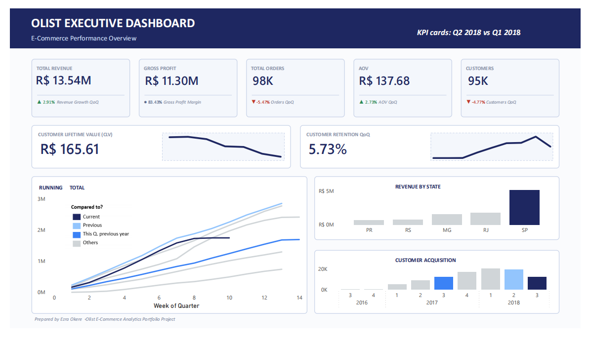
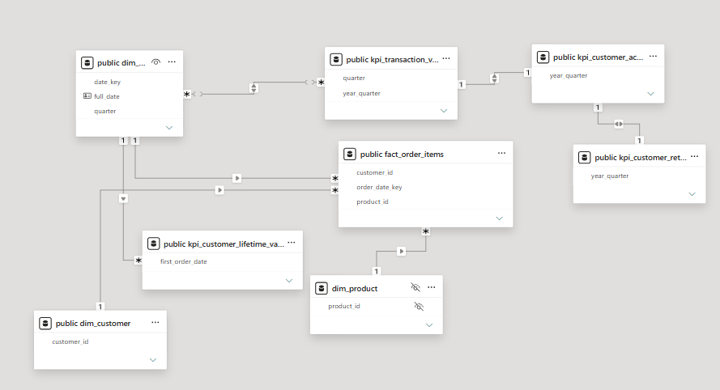
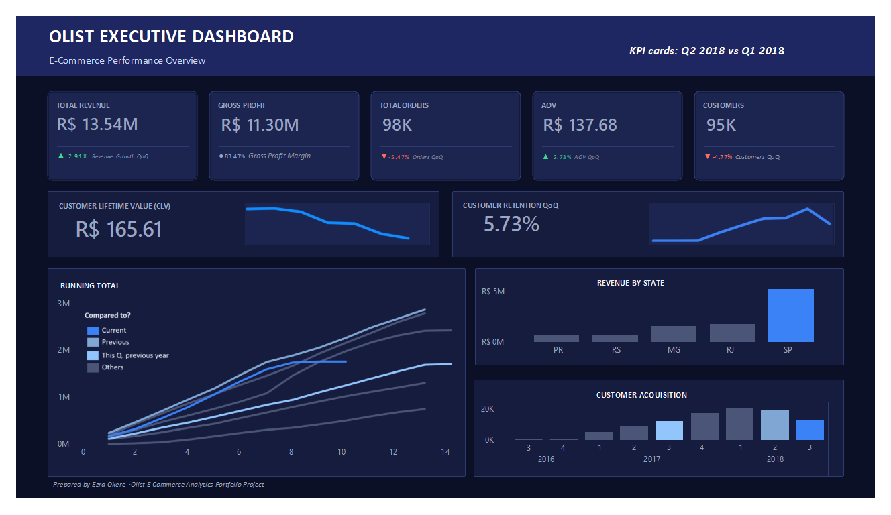

# Olist E-Commerce Analytics: From Raw Data to Executive Dashboard

**Python · PostgreSQL · Power BI**

An end-to-end analytics project built on the Brazilian Olist e-commerce dataset (about 100K orders, 2016–2018). Raw CSV files are cleaned in Python, modelled in PostgreSQL with a star-schema-style view layer, and visualised in a Power BI executive dashboard covering revenue, orders, AOV, customer acquisition, retention and customer lifetime value.

<picture>
  <source media="(prefers-color-scheme: dark)" srcset="images/dashboard_dark.png">
  <source media="(prefers-color-scheme: light)" srcset="images/dashboard_light.png">
  
</picture>

---

## Project Pipeline

```
Raw CSVs (9 files)  →  Jupyter / Python  →  PostgreSQL  →  Power BI
                         clean + type        model + KPI      Executive
                         + load              views            Dashboard
```

| Stage | Tool | What happens |
|-------|------|--------------|
| 1. Clean | Python (pandas, SQLAlchemy) | Fix data types, handle nulls and duplicates, engineer delivery features, load to PostgreSQL |
| 2. Model | PostgreSQL | Build a fact view, dimension views and KPI views |
| 3. Visualise | Power BI | Relationships, DAX measures, executive dashboard |

---

## Business Questions

- How is revenue trending quarter over quarter?
- Are we growing through more orders or higher order values?
- How many new customers do we acquire each quarter?
- How many customers come back, and what is a customer worth over their lifetime?
- Which states drive the most revenue?

---

## Repository Structure

```
olist-ecommerce-analytics/
├── notebooks/
│   └── 01_olist_data_cleaning_and_sql_load.ipynb
├── scripts/
│   └── 01_olist_data_cleaning_and_sql_load.py
├── sql/
│   ├── fact_order_items.sql
│   ├── dim_date.sql
│   ├── dim_customer.sql
│   ├── kpi_customer_acquisition_qoq.sql
│   ├── kpi_customer_lifetime_value.sql
│   ├── kpi_customer_retention_qoq.sql
│   └── kpi_transaction_value_qoq.sql
├── powerbi/
│   └── olist_executive_dashboard.pbix
├── images/
│   ├── dashboard_light.png
│   ├── dashboard_dark.png
│   └── data_model.png
└── README.md
```

---

## 1. Data Cleaning (Python)

Notebook: `01_olist_data_cleaning_and_sql_load.ipynb` (also available as a `.py` script).

- Loads all 9 Olist CSVs directly from the zip archive
- Checks every table for duplicates, nulls and wrong data types
- Standardises types: IDs as strings, zip codes zero-padded to 5 digits, dates as datetimes, money columns rounded to 2 decimals
- Reduces the geolocation table from about 1M rows to 19,015 by averaging coordinates per zip prefix
- Fills missing product categories with `Unknown` and adds English category names (including manual translations for categories missing from the translation file)
- Engineers delivery features on the orders table: `delivery_time_days`, `target_delivery_time_days` and `is_late`
- Defines explicit SQL column types and loads the 9 cleaned tables into PostgreSQL

## 2. SQL Modelling (PostgreSQL)

The cleaned tables are exposed through views that Power BI connects to.

| View | Purpose |
|------|---------|
| `fact_order_items` | One row per order item, joined to order status, dates and first payment record |
| `dim_date` | Generated calendar (2016–2020) with year, quarter, month, week and weekend flags |
| `dim_customer` | Customer attributes and a combined city/state location |
| `kpi_transaction_value_qoq` | Quarterly transaction value, orders, AOV and QoQ growth |
| `kpi_customer_acquisition_qoq` | New customers per quarter (first order, deduplicated by `customer_unique_id`) and QoQ growth |
| `kpi_customer_retention_qoq` | Customers active in a quarter who were also active in the previous one |
| `kpi_customer_lifetime_value` | Per-customer orders, revenue, lifespan and repeat-customer flag |

Design choices:
- Customers are deduplicated with `customer_unique_id`, because `customer_id` changes with every order.
- Canceled and unavailable orders are excluded from the KPI views.
- Transaction value is `price + freight_value`.
- Only the first payment record (`payment_sequential = 1`) is joined to avoid duplicating order rows.

## 3. Power BI Model and Dashboard

**Data model.** `fact_order_items` sits at the centre and connects to `dim_date`, `dim_customer` and `dim_product`. The four KPI views connect to `dim_date` and to each other on `year_quarter`.



**DAX measures (examples):** Total Revenue, Gross Profit, Gross Profit Margin, Total Orders, AOV, Revenue QoQ %, Orders QoQ %, Customers QoQ %, Value of Transaction QoQ %, Running Total Revenue (QTD), Avg CLV, Repeat Customer Rate.

**Themes.** The dashboard is built in both a light and a dark theme.

| Light | Dark |
|:-----:|:----:|
|  |  |

**Dashboard sections:**
- KPI cards: Total Revenue, Gross Profit, Total Orders, AOV, Customers (each with QoQ change)
- Customer Lifetime Value and Customer Retention QoQ with trend lines
- Running Total Revenue by week of quarter, compared across quarters
- Revenue by State
- Customer Acquisition by quarter

---

## Key Insights

- **São Paulo dominates revenue.** SP is the clear top state, well ahead of RJ, MG, RS and PR.
- **Growth is coming from order value, not volume.** AOV rose 2.73% QoQ and revenue rose 2.91%, while orders fell 5.47% and customers fell 4.77%.
- **Retention is very low.** Only 5.73% of customers return in the following quarter, so the marketplace relies heavily on acquiring new customers.
- **Customer acquisition peaked in early 2018** and then declined. Note that the latest quarter may be incomplete, which can exaggerate QoQ declines.
- **Average customer value is trending down** over the period shown.

---

## Assumptions and Limitations

- The Olist dataset has no cost data, so **Gross Profit** is a simplified measure. *(Add your exact definition here.)*
- **CLV** is calculated as historical total spend per customer (`price + freight_value`), not a predictive model.
- QoQ comparisons for the most recent quarter may be affected by partial-quarter data.
- Data covers 2016–2018 only.

---

## How to Run

1. Download the dataset from Kaggle: *Brazilian E-Commerce Public Dataset by Olist* and place the zip in the project folder.
2. Install requirements: `pip install pandas sqlalchemy psycopg2-binary`
3. Start a local PostgreSQL server and update the connection string if needed.
4. Run the notebook (or `python scripts/01_olist_data_cleaning_and_sql_load.py`) to clean the data and load it into the `ecommerce_database` database.
5. Run the SQL files in `sql/` in this order: `dim_date`, `dim_customer`, `fact_order_items`, then the four KPI views.
6. Open the `.pbix` file in Power BI Desktop and refresh the data source to point at your database.

---

## Tools

Python (pandas, SQLAlchemy) · PostgreSQL · Power BI (DAX, data modelling) · Jupyter Notebook

---

## Author

**Ezra**
Data Analyst
[GitHub](https://github.com/MichaelOkere30?tab=repositories) · [LinkedIn](https://www.linkedin.com/in/ezra-val-okere-1a84b4273)
